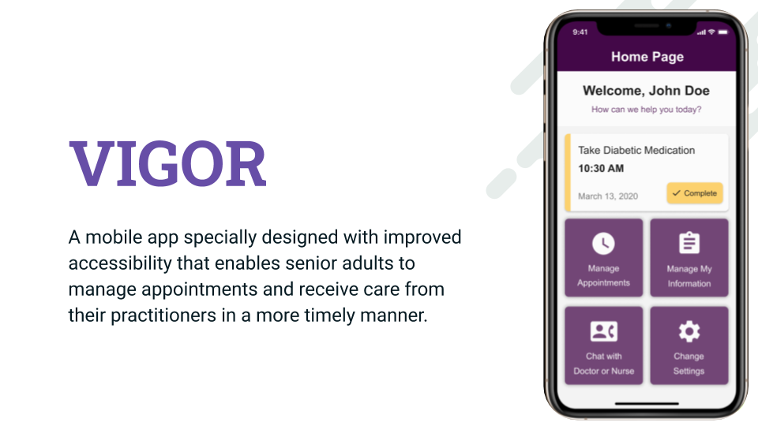

# DubHacks 2020 Mobile App

Mobile App Project Repo for DubHacks 2020 (the largest 24-hour hackathon hosted in the Pacific Northwest). Our project name is VIGOR - Better Care and better health just one touch away.

You can watch the project video by clicking this image:

## Tools and Framework Used:

This project was developed using [React Native](https://reactnative.dev/) and the open-source platform of [Expo](https://docs.expo.io/). We created the frontend with React Native and used Google's [Firebase](https://firebase.google.com/) to handle the backend functionality

## Mobile App UI Design:

We use Figma for our design : [UI Prototype](https://www.figma.com/file/9ILk7u3RypARp0N5T6eFcl/DubHacks-2020?node-id=76%3A2125)

## Routing and Navigation:

We used [React Navigation](https://reactnavigation.org/) to handle the screen transitions

## Authentication & Database Storage

We used Google's [Firebase](https://firebase.google.com/) to enable the Gmail log in feature and store user information

## UI Library Used:

[React Native Paper](https://callstack.github.io/react-native-paper/index.html)

## Project Structure:

-   assets (all images and icons placed in corresponding screen names)
-   components (all reusable components)
-   data (typography/color/general data information)
-   routes (navigation and screens)

## Available Scripts:

In the project directory, you can run:

### `npm install`

to install all packages.

After installing all packages, you can run

### `npm start`

to run the app in the development mode. This should bring you to a platform where you can run the mobile app using an emulator or simply scan the QRCode with the Expo App installed on your mobile devices.

## Copyright & License

Copyright 2020 Haoyang Chen, Yuqi Feng, Anh Le, Gerorge Gu, Jazmynn Combes-Troyer under the [GPL-3.0 License](https://github.com/HaoyangChen/ifu-2/blob/master/LICENSE)
